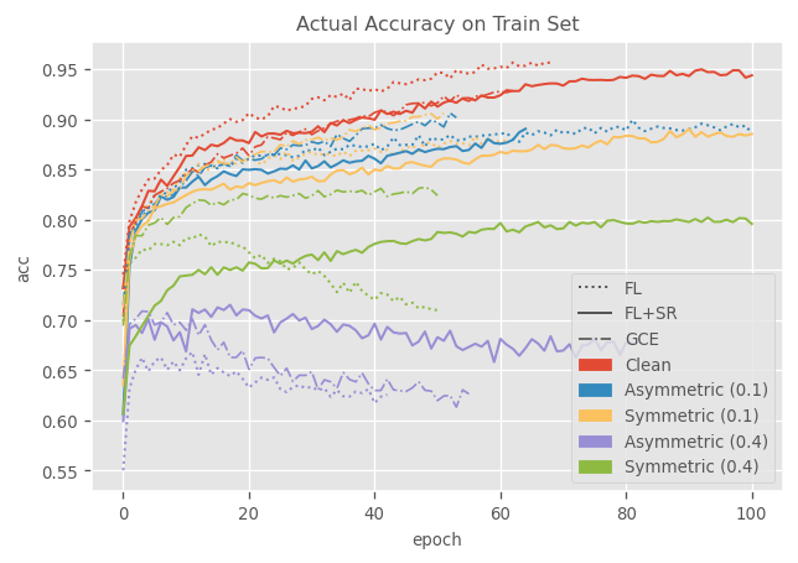
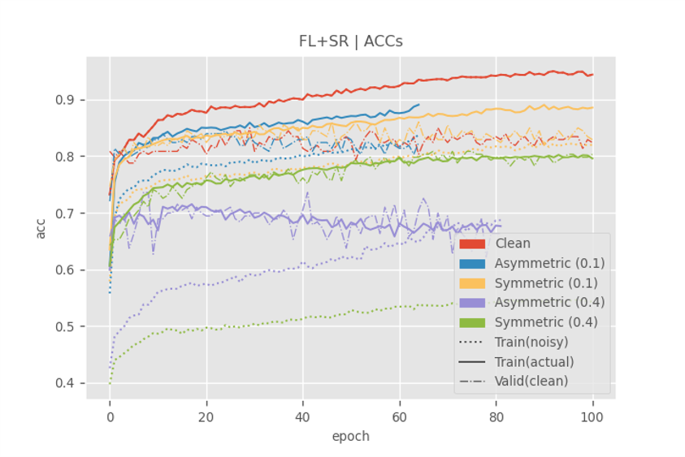

# ISIC 2018 | Learning with Noisy Labels via Sparse Regularization

Robust learning on ISIC 2018[^1], based on *Learning with Noisy Labels via Sparse Regularization* (ICCV 2021)[^2].

## Experiments

### Settings

1. **Noise Corruption**: a clean label y is flipped into a random noisy version $y ̃ $with probability $η(x,y ̃) = p(y ̃|y, x)$

   - **Symmetric**: with equal probability $η/6$

   - **Asymmetric**: NV↔MEL, BCC↔BKL, VASC↔DF, AKIEC↔DF
   - $η = 0, 0.1, 0.4$

2. Loss Function

   a) **Focal Loss**
   $$
   \mathrm{FL}\left(p,\ y\right)=-\sum_{t=1}^{n}{y_t\left(1-p_t\right)^\gamma\log{\left(p_t\right)}}
   $$
   

   where $γ=0.5$

   b) **Focal Loss + SR**
   $$
   \mathrm{FLSR}\left(p,\ y\right)=-\sum_{t=1}^{n}{y_t\left(1-p_t\right)^\gamma\log{\left(p_t\right)}}+\lambda \|p_t\|_p^p
   $$
   

   where $p=\frac{exp{\left(\frac{z_i}{\tau}\right)}}{\sum_{j=1}^{n}exp{\left(\frac{z_j}{\tau}\right)}},\ \tau=0.5,\lambda_t=5・ 1.005^{t/1}$

   c) **GCE**[^3]
   $$
   \mathrm{GCEL}\left(p,y\right)=\sum_{t=1}^{n}{y_t\frac{\left(1-p_t^q\right)}{q}}
   $$
   

   where $p=0.7$

### Results

| AUC             |            |            |            |            |            |
| --------------- | :--------: | :--------: | :--------: | :--------: | :--------: |
| Noise Type      |    None    | Asymmetric | Symmetric  | Asymmetric | Symmetric  |
| 𝜂               |     0      |    0.1     |            |    0.4     |            |
| Focal Loss      | **0.9856** |   0.9766   |   0.9691   |   0.9235   |   0.9224   |
| Focal Loss + SR |   0.9854   |   0.9778   |   0.9725   | **0.9443** |   0.9517   |
| GCE             |   0.9837   | **0.9804** | **0.9789** |   0.9256   | **0.9674** |

| ACC             |           |            |           |                   |                   |
| --------------- | :-------: | :--------: | :-------: | :---------------: | :---------------: |
| Noise Type      |   None    | Asymmetric | Symmetric |    Asymmetric     |     Symmetric     |
| 𝜂               |     0     |    0.1     |           |        0.4        |                   |
| Focal Loss      | **0.855** |   0.817    |   0.803   |   0.573 (0.691)   |   0.683 (0.782)   |
| Focal Loss + SR |   0.853   |   0.821    | **0.829** | **0.700 (0.720)** | **0.784** (0.776) |
| GCE             |   0.851   | **0.826**  |   0.827   |   0.605 (0.702)   | 0.782(**0.798**)  |

(): the best model on validation set

### Training Process

Loss Function

Noise Type

### Under Adversarial Attacks

The robustness of aforementioned models under adversarial attacks is also tested.

Trained with sparse regularization, the model is relatively robust against perturbations.

| Training Method | Accuracy  |           |           |       |
| --------------- | :-------: | :-------: | :-------: | :---: |
|                 |   Clean   | Gaussian  |   FGSM    |  PGD  |
| FL              | **0.855** |   0.675   |   0.287   | 0.000 |
| FL+SR           |   0.853   | **0.745** | **0.309** | 0.000 |
| GCE             |   0.851   |   0.698   |   0.243   | 0.000 |

While trained on dataset containing hand-crafted noisy labels, the model gets higher accuracy under adversarial attacks.

| Noisy Labels   | Accuracy  |           |           |       |
| -------------- | :-------: | :-------: | :-------: | :---: |
|                |   Clean   | Gaussian  |   FGSM    |  PGD  |
| Clean          |   0.853   |   0.745   |   0.309   | 0.000 |
| 0.1 Asymmetric |   0.826   |   0.673   |   0.230   | 0.000 |
| 0.1 Symmetric  | **0.829** | **0.726** |   0.381   | 0.000 |
| 0.4 Asymmetric |   0.700   |   0.599   |   0.291   | 0.000 |
| 0.4 Symmetric  |   0.784   |   0.716   | **0.417** | 0.000 |

## References

[^1]: HAM10000 Dataset: (c) by ViDIR Group, Department of Dermatology, Medical University of Vienna; https://doi.org/10.1038/sdata.2018.161
[^2]: X. Zhou, X. Liu, C. Wang, D. Zhai, J. Jiang and X. Ji, "Learning with Noisy Labels via Sparse Regularization," *2021 IEEE/CVF International Conference on Computer Vision (ICCV)*, 2021, pp. 72-81, doi: 10.1109/ICCV48922.2021.00014.
[^3]: Zhang, Zhilu, and Mert Sabuncu. ‘Generalized Cross Entropy Loss for Training Deep Neural Networks with Noisy Labels’. In *Advances in Neural Information Processing Systems*, Vol. 31. Curran Associates, Inc., 2018. https://proceedings.neurips.cc/paper/2018/hash/f2925f97bc13ad2852a7a551802feea0-Abstract.html.

